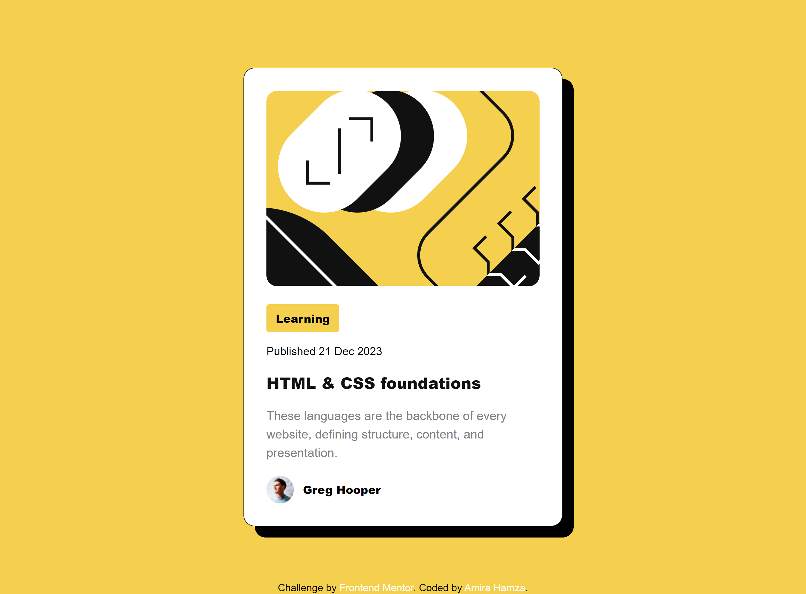
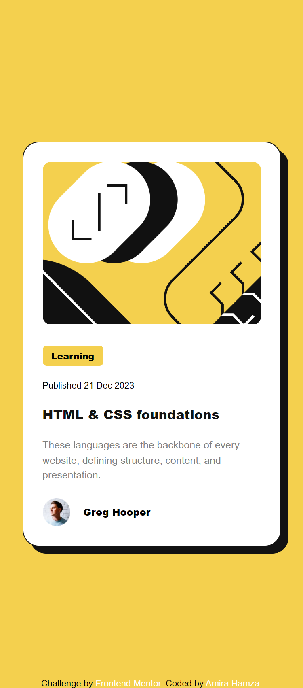

# Frontend Mentor - Blog preview card solution

This is a solution to the [Blog preview card challenge on Frontend Mentor](https://www.frontendmentor.io/challenges/blog-preview-card-ckPaj01IcS). Frontend Mentor challenges help you improve your coding skills by building realistic projects. 

## Table of contents

- [Frontend Mentor - Blog preview card solution](#frontend-mentor---blog-preview-card-solution)
  - [Table of contents](#table-of-contents)
    - [The challenge](#the-challenge)
    - [Screenshot](#screenshot)
    - [Links](#links)
    - [Continued development](#continued-development)
  - [Author](#author)
  - [Acknowledgments](#acknowledgments)

### The challenge

Users should be able to:

- See hover and focus states for all interactive elements on the page

### Screenshot

### Links

-  [Solution URL](https://www.frontendmentor.io/solutions/responsive-blog-preview-card-1nDw7LFD2v)
-  [Live Site URL:](https://amiraxhamza.github.io/--Frontend-Mentor---Blog-preview-card-solution/)

### Continued development

I struggeled to fit the image where I needed it to be. On the larger screen it kind of crops the image a bit when I position it, I would like to work on that.

## Author
- Frontend Mentor - [@AmiraxHamza](https://www.frontendmentor.io/profile/AmiraxHamza)

## Acknowledgments

Thank you internet.